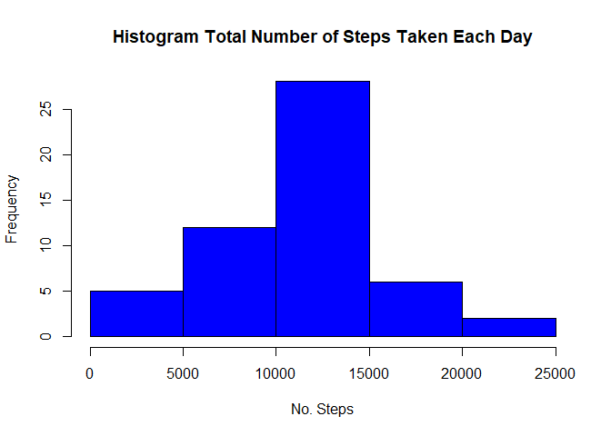
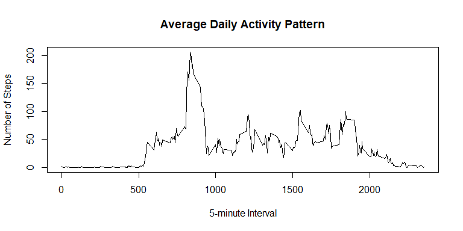
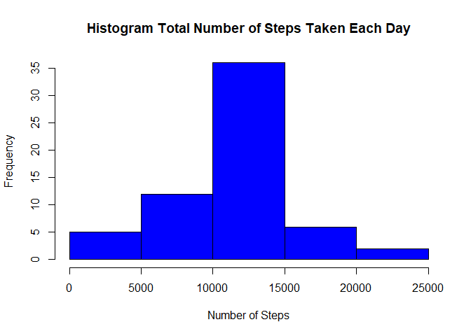

# Reproducible Research: Peer Assessment 1


## Loading and preprocessing the data
### Read  the CSV  file in table format and create a data frame 
### Convert the date values to a  R date object

```r
df <- read.csv("activity.csv", header = TRUE)
df$date <- as.Date(df$date)
```


## What is mean total number of steps taken per day?
### Use aggregate function to calculate the total number of steps per day
### Create  a histogram for total number of steps taken each day


```r
#totalSteps <- with(df,tapply(df$steps,df$date,FUN = sum, na.rm = TRUE))
totalSteps <- aggregate(steps ~ date,data = df, sum, na.rm = TRUE)

hist(totalSteps$steps,col = "blue", xlab = "No. Steps", main = "Histogram Total Number of Steps Taken Each Day")
```

<!-- -->

```r
#qplot(totalSteps, geom = "histogram", binwidth = 1000, xlab = "Total Steps", ylab = "Number of Days", main = "Total Number #of Steps Taken Each Day")
```

### Determine mean and median total number of steps taken per day

```r
meanSteps <- mean(totalSteps$steps, na.rm = TRUE)
medianSteps <- median(totalSteps$steps, na.rm = TRUE)
meanSteps
```

```
## [1] 10766.19
```

```r
medianSteps
```

```
## [1] 10765
```
### The mean  total number of steps taken per day is 10766.
### The median total number of steps taken per day is 10765.


## What is the average daily activity pattern?
###Create a time series plot  of the 5-minute interval (x-axis) and the average number of steps taken, averaged across all days (y-axis)

```r
avgStepsPerInt <- with(na.omit(df),tapply(steps,interval,mean))

plot(names(avgStepsPerInt), avgStepsPerInt, type = "l", xlab = "5-minute Interval", 
    ylab = "Number of Steps", main = "Average Daily Activity Pattern")
```

<!-- -->

###Determine the 5-minute interval, on average across all the days in the dataset, that contains the maximum number of steps

```r
maxIndex <- which(avgStepsPerInt == max(avgStepsPerInt))
maxInterval <- df$interval[maxIndex]
maxInterval
```

```
## [1] 835
```
###The 5-minute interval, on average across all the days in the dataset, that contains the maximum number of step is 835.

## Imputing missing values

### Calculate  the total number of missing values in the dataset (i.e. the total number of rows with NAs)

```r
mv <- sum(is.na(df))
mv
```

```
## [1] 2304
```
### The total number of missing values in the dataset: 2304

### Devise a strategy for filling in all of the missing values in the dataset. The strategy does not need to be 
### sophisticated. For example, you could use the mean/median for that day, or the mean for that 5-minute interval, etc.

### The following strategy includes:
### 1 Create a copy of the dataset
### 2 Loop through each record in the copy of the data set
### 3 Check if there is a missing value in the steps field
### 4.Call a function to calculate the mean steps per interval if a steps value is missing
### 5.Update the the missing value with the calculated mean steps per interval in the copy of the data set 


### Create a new dataset that is equal to the original dataset but with the missing data filled in

```r
df2<-aggregate(steps~interval,data=df,mean,na.rm=TRUE)
getMeanSteps<-function(interval){
    df2[df2$interval==interval,]$steps
}

df3<-df   
count=0           
for(i in 1:nrow(df3)){
    if(is.na(df3[i,]$steps)){
        df3[i,]$steps<-getMeanSteps(df3[i,]$interval)
        count=count+1
    }
}


mv <- sum(is.na(df3))
mv
```

```
## [1] 0
```
### Make a histogram of the total number of steps taken each day and Calculate and report the mean and median total number ### of steps taken per day. Do these values differ from the estimates from the first part of the assignment? What is the ### impact of imputing missing data on the estimates of the total daily number of steps?


```r
totalSteps2 <- aggregate(steps ~ date,data = df3, sum)

hist(totalSteps2$steps,col = "blue", xlab = "Number of Steps", main = "Histogram Total Number of Steps Taken Each Day")
```

<!-- -->

```r
meanSteps2 <- mean(totalSteps2$steps)
medianSteps2 <- median(totalSteps2$steps)
meanSteps2
```

```
## [1] 10766.19
```

```r
medianSteps2
```

```
## [1] 10766.19
```


### The mean  total number of steps taken per day is 10766.
### The median total number of steps taken per day is 10766.

### There is almost no impact on the mean and median values by  imputing missing data on the estimates of the total daily number ### of steps. The mean value remains the same at 10766. The median value changed from 10765 to 10766. The frequency has increased as can be seen in particular the center bar of the histogram.

## Are there differences in activity patterns between weekdays and weekends?
### For this part the weekdays() function may be of some help here. Use the dataset with the filled-in missing values for ### this part.
### 1.Create a new factor variable in the dataset with two levels - "weekday" and "weekend" indicating whether a given date is a weekday or weekend day.


```r
wdays <- weekdays(df3$date)
satsun <- (wdays == "Saturday" | wdays == "Sunday")
dfactor <- factor(satsun, labels = list("weekday", "weekend"))
df3$dtype <- dfactor
```

### Make a panel plot containing a time series plot (i.e. type = "l") of the 5-minute interval (x-axis) and the average 
### number of steps taken, averaged across all weekday days or weekend days (y-axis). See the README file in the GitHub 
### repository to see an example of what this plot should look like using simulated data.


```r
totalSteps3 <- aggregate(df3$steps, list(DayType = df3$dtype, Interval = df3$interval), mean)

xyplot(totalSteps3$x ~ totalSteps3$Interval | totalSteps3$DayType, layout = c(1, 
    2), xlab = "Interval", ylab = "Number of Steps", type = "l")
```

<!-- -->
